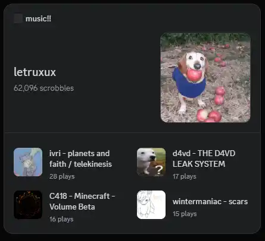

# last.fm + Discord Widget

Shows your top 4 albums from the last month in your Discord profile

[How to make a custom discord widget](https://chloecinders.com/blog/discord-widgets#creating-your-widget)

For reference, the widget payload is in `widget_patch_payload.json`

If you manage to set this up, you can run it by filling in the `.env` file and running `bun .`
